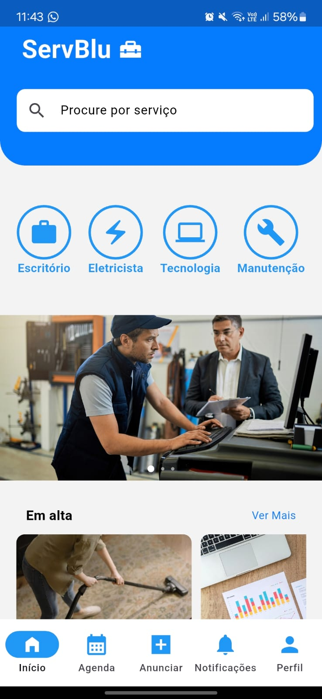
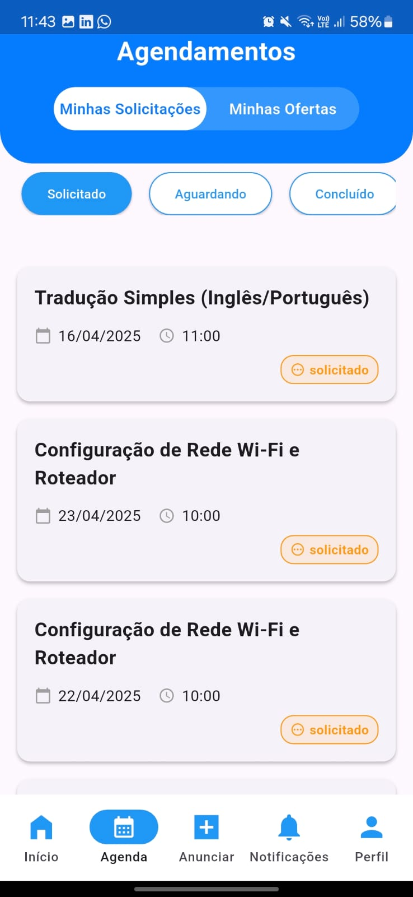
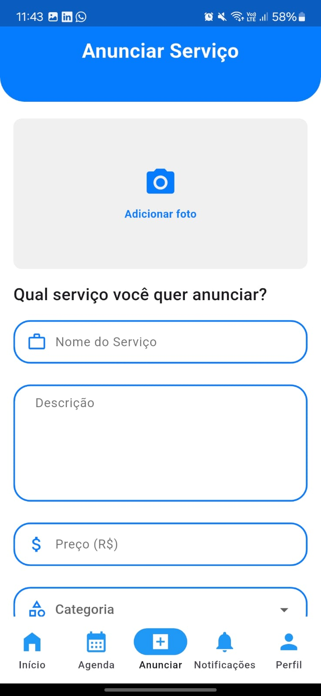
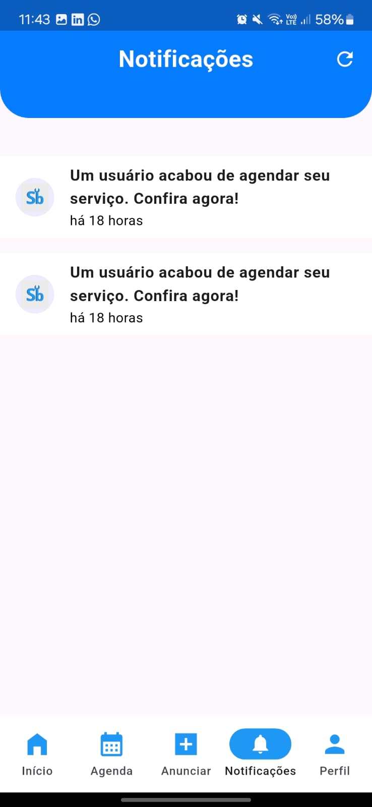
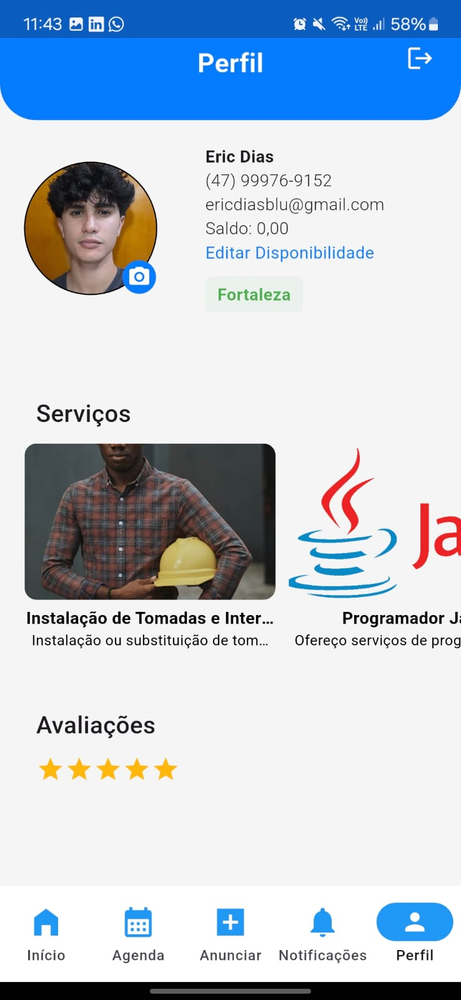
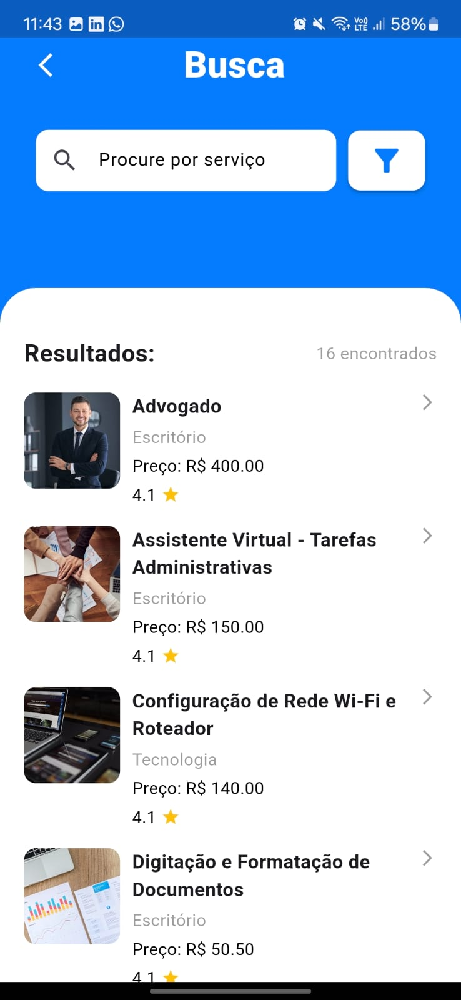

# ServBlu

### Plataforma de Conexão entre Clientes e Prestadores de Serviço

---

## 📱 Sobre o Projeto

O **ServBlu** é um aplicativo desenvolvido com **Flutter**, idealizado para facilitar a conexão entre clientes e prestadores de serviços diversos, como manutenção, limpeza, aulas e muito mais.

Criado no contexto do programa **+DEVS2BLU**, o projeto é parte integrante das unidades curriculares:
- Desenvolvimento Avançado com Flutter
- Conteinerização e Orquestração
- Gestão e Gerenciamento de Projetos de TI

---
## Veja abaixo algumas telas do aplicativo **ServBlu**:

Veja abaixo algumas telas do aplicativo **ServBlu**:

   
 
   
  
  

    

   
 
  
  

## 📌 Objetivo Principal

- Criar uma **plataforma eficiente e segura** para conectar clientes e prestadores de serviços, proporcionando uma experiência de contratação **simplificada**, **confiável** e **acessível**.
---

## 🎯 Objetivos Secundários

- 🔍 Implementar sistema de **busca avançada** por localização, preço e avaliações.
- 💳 Integrar com **sistemas de pagamento confiáveis** para transações seguras.
- 🗓️ Disponibilizar **agendamento de serviços** diretamente pelo app.
- 🔔 Criar sistema de **notificações** para alertas e lembretes.
- 🌟 Permitir **avaliações e feedbacks** dos serviços prestados.

---

## 🛠️ Tecnologias Utilizadas

- Flutter
- Dart
- NodeJs (API de pagamentos)
- Firebase (autenticação, push notifications)
- Supabase (banco de dados)
- Figma (prototipação)
- Git

---

## 📝 Licença

Este projeto é acadêmico e está sob a orientação do programa +DEVS2BLU. Direitos reservados aos autores.

---

## 🚀 Funcionalidades

- Cadastro e gerenciamento de **usuários** e **prestadores**
- Filtros por **localização**, **preço** e **tipo de serviço**
- Sistema de **agendamento e confirmação de serviços**
- Integração com **pagamentos online**
- Avaliação e **feedback**
- Notificações em tempo real sobre agendamentos e promoções

---

## 💡 Motivação

Muitas pessoas enfrentam dificuldades ao buscar profissionais de confiança. A ausência de uma plataforma centralizada gera **ineficiência** e **falta de segurança** nas contratações. O ServBlu surge para resolver esse problema, otimizando o processo com tecnologia e praticidade.

---

## 👥 Equipe Trinity

- **Eric Dias**  
  _Word, Excel, PowerPoint, Dart, Java, HTML, CSS, Python, MySQL, Flutter_
  
- **Vítor Rodrigues**  
  _Java, React, MySQL, Dart, Next.js, Figma_
  
- **Eduardo Hessmann Rohleder**  
  _Java, Dart, Word, Excel, PowerPoint, Flutter, HTML, CSS, MySQL, Figma, MVC_

---

